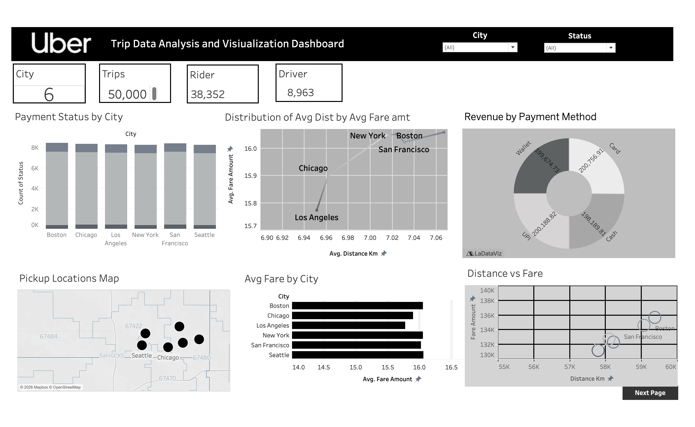
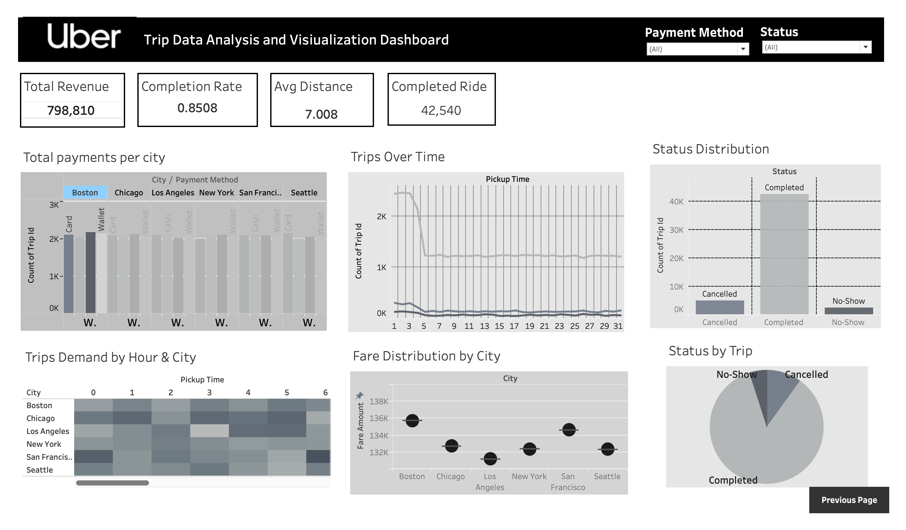

# Uber Trip Data Dashboard (Tableau)

An interactive Tableau dashboard project that analyzes Uber trip performance across cities, ride status, payment behavior, demand trends, and fare patterns.

## Project Overview

This project presents a multi-page Uber analytics dashboard built in Tableau. It is designed to help stakeholders quickly understand operational and business performance through clear KPI cards, trend visuals, and city-level comparisons.

## Key Insights Covered

- Total trips, completed rides, and completion rate
- Revenue and payment method distribution
- Trip status split (Completed, Cancelled, No-Show)
- City-wise fare and demand comparison
- Time-based trends for trip volume
- Distance vs fare relationship analysis

## Dashboard Assets

- Tableau workbook: `dashboard/uber dasboard.twbx`
- Dashboard screenshots:
  - `screenshots/overview.png`
  - `screenshots/analytics.png`

## Dashboard Preview

### Overview Page



### Analytics Page



## Tableau Public

This dashboard is published on Tableau Public.

- Live Dashboard: [Add your published dashboard URL here](https://public.tableau.com/)

## Tools Used

- Tableau Desktop
- Tableau Public

## How to Open Locally

1. Open Tableau Desktop.
2. Load the workbook from `dashboard/uber dasboard.twbx`.
3. Use filters and dashboard navigation buttons to explore insights.

## Repository Structure

```text
.
├── README.md
├── dashboard/
│   └── uber dasboard.twbx
└── screenshots/
    ├── overview.png
    └── analytics.png
```
